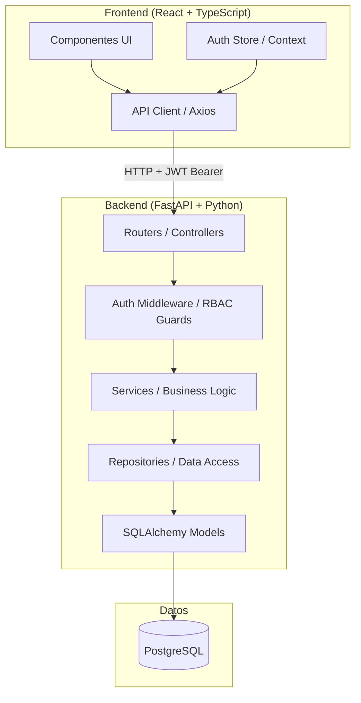
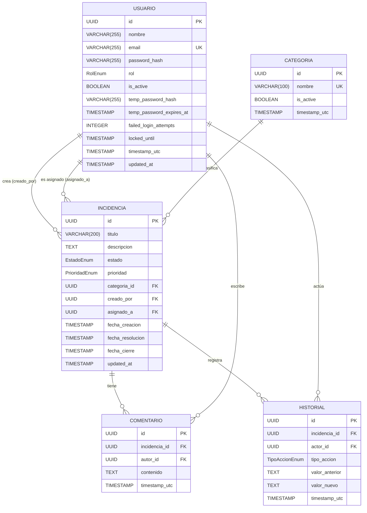
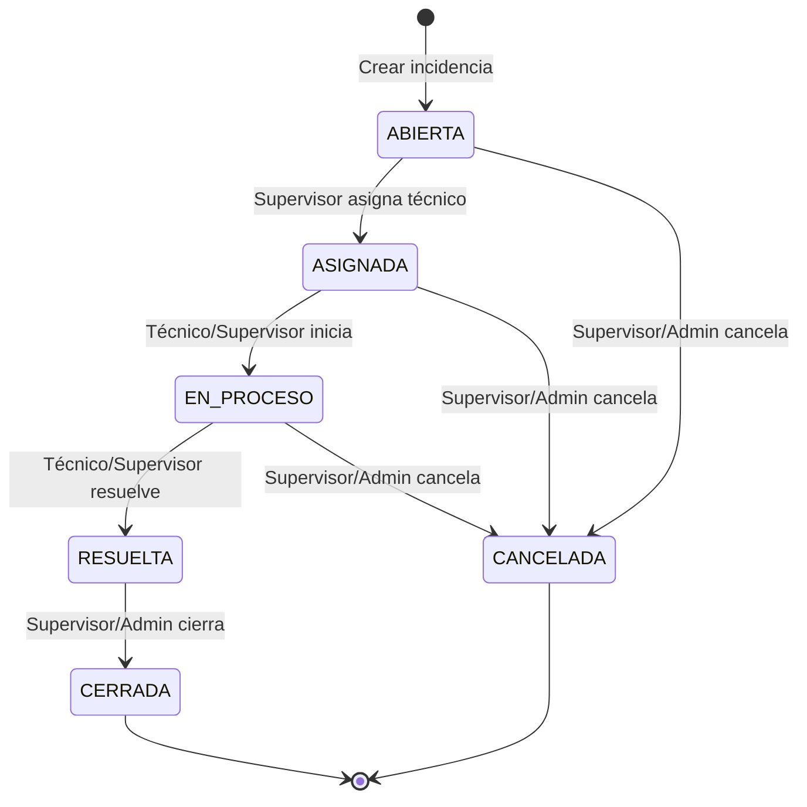
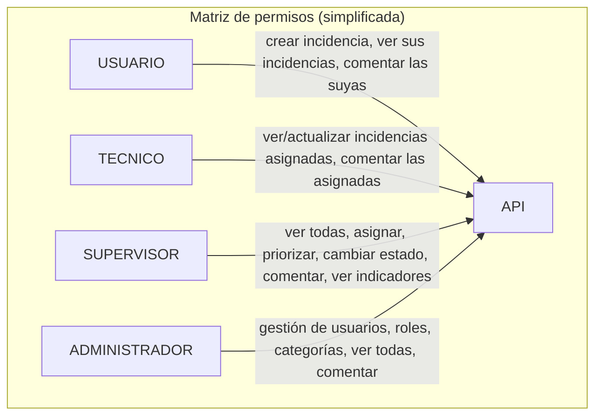

# Design Document: Sistema de Gestión de Incidencias (SGI)

## Overview

El SGI es una plataforma web para registrar, gestionar, escalar y resolver incidencias dentro de una organización. La arquitectura sigue un modelo cliente-servidor desacoplado: el frontend (React + TypeScript) consume una API REST construida con FastAPI (Python), respaldada por PostgreSQL como base de datos relacional. La autenticación se realiza mediante tokens JWT y la autorización aplica RBAC con cuatro roles diferenciados.

El sistema cubre los siguientes dominios funcionales:

- **Autenticación y autorización** — JWT con expiración, bloqueo por intentos fallidos, RBAC.
- **Gestión de incidencias** — ciclo de vida completo con máquina de estados de seis estados.
- **Asignación y priorización** — supervisores asignan técnicos y ajustan prioridades.
- **Comentarios** — notas trazables por incidencia, con reglas de acceso por rol y estado.
- **Historial de auditoría** — registro inmutable de todos los cambios relevantes.
- **Gestión de usuarios y categorías** — administradores controlan el acceso y la taxonomía.
- **Indicadores** — estadísticas agregadas sobre el estado operativo del sistema.

---

## Architecture

### Diagrama de componentes



### Arquitectura de capas del backend

```
fastapi_app/
├── main.py                    # FastAPI app factory, CORS, middleware registration
├── core/
│   ├── config.py              # Settings via pydantic-settings
│   ├── security.py            # JWT creation/verification, bcrypt helpers
│   └── dependencies.py        # get_current_user, require_role factories
├── db/
│   ├── session.py             # SQLAlchemy engine + SessionLocal
│   └── base.py                # Declarative base
├── models/                    # SQLAlchemy ORM models (one file per entity)
│   ├── usuario.py
│   ├── incidencia.py
│   ├── comentario.py
│   ├── historial.py
│   └── categoria.py
├── schemas/                   # Pydantic v2 request/response schemas
│   ├── auth.py
│   ├── usuario.py
│   ├── incidencia.py
│   ├── comentario.py
│   ├── historial.py
│   ├── categoria.py
│   └── indicadores.py
├── repositories/              # Data access objects (pure DB operations)
│   ├── usuario_repo.py
│   ├── incidencia_repo.py
│   ├── comentario_repo.py
│   ├── historial_repo.py
│   └── categoria_repo.py
├── services/                  # Business logic (orchestrates repos, enforces rules)
│   ├── auth_service.py
│   ├── usuario_service.py
│   ├── incidencia_service.py
│   ├── comentario_service.py
│   ├── historial_service.py
│   ├── categoria_service.py
│   └── indicadores_service.py
└── routers/                   # FastAPI routers (HTTP layer only)
    ├── auth.py
    ├── usuarios.py
    ├── incidencias.py
    ├── comentarios.py
    ├── historial.py
    ├── categorias.py
    └── indicadores.py
```

**Principio de separación de responsabilidades:**

| Capa | Responsabilidad |
|---|---|
| **Routers** | Recibir HTTP, validar payload con Pydantic, invocar service, devolver respuesta |
| **Services** | Aplicar reglas de negocio, orquestar repos, lanzar excepciones de dominio |
| **Repositories** | Ejecutar queries SQLAlchemy, devolver modelos ORM |
| **Models** | Mapeo ORM → tablas PostgreSQL |
| **Schemas** | Validación entrada/salida con Pydantic v2 |

---

## Components and Interfaces

### Autenticación y autorización

**`core/security.py`**
```python
def hash_password(plain: str) -> str: ...
def verify_password(plain: str, hashed: str) -> bool: ...
def create_access_token(data: dict, expires_delta: timedelta) -> str: ...
def decode_access_token(token: str) -> dict: ...  # raises JWTError if invalid/expired
```

**`core/dependencies.py`**
```python
async def get_current_user(token: str = Depends(oauth2_scheme), db: Session = ...) -> Usuario: ...
def require_role(*roles: RolEnum) -> Callable:
    """Factory que retorna un Depends que verifica el rol del usuario actual."""
```

### Servicio de Incidencias

**`services/incidencia_service.py`**
```python
def crear_incidencia(db, actor, payload: IncidenciaCreate) -> Incidencia: ...
def listar_incidencias(db, actor, filtros: IncidenciaFiltros, paginacion: Paginacion) -> Page[Incidencia]: ...
def obtener_incidencia(db, actor, incidencia_id: UUID) -> Incidencia: ...
def actualizar_estado(db, actor, incidencia_id: UUID, nuevo_estado: EstadoEnum) -> Incidencia: ...
def asignar_tecnico(db, actor, incidencia_id: UUID, tecnico_id: UUID) -> Incidencia: ...
def actualizar_prioridad(db, actor, incidencia_id: UUID, nueva_prioridad: PrioridadEnum) -> Incidencia: ...
```

### Servicio de Historial

**`services/historial_service.py`**
```python
def registrar_cambio(db, actor_id: UUID, incidencia_id: UUID, tipo: TipoAccionEnum,
                     valor_anterior: str, valor_nuevo: str) -> None:
    """Solo registra si valor_anterior != valor_nuevo."""
```

### Máquina de estados

```python
TRANSICIONES_VALIDAS: dict[EstadoEnum, set[EstadoEnum]] = {
    EstadoEnum.ABIERTA:    {EstadoEnum.ASIGNADA, EstadoEnum.CANCELADA},
    EstadoEnum.ASIGNADA:   {EstadoEnum.EN_PROCESO, EstadoEnum.CANCELADA},
    EstadoEnum.EN_PROCESO: {EstadoEnum.RESUELTA, EstadoEnum.CANCELADA},
    EstadoEnum.RESUELTA:   {EstadoEnum.CERRADA},
    EstadoEnum.CERRADA:    set(),
    EstadoEnum.CANCELADA:  set(),
}
```

---

## Data Models

### Diagrama entidad-relación



### Enumeraciones

```python
class RolEnum(str, Enum):
    USUARIO = "USUARIO"
    TECNICO = "TECNICO"
    SUPERVISOR = "SUPERVISOR"
    ADMINISTRADOR = "ADMINISTRADOR"

class EstadoEnum(str, Enum):
    ABIERTA = "ABIERTA"
    ASIGNADA = "ASIGNADA"
    EN_PROCESO = "EN_PROCESO"
    RESUELTA = "RESUELTA"
    CERRADA = "CERRADA"
    CANCELADA = "CANCELADA"

class PrioridadEnum(str, Enum):
    BAJA = "BAJA"
    MEDIA = "MEDIA"
    ALTA = "ALTA"
    CRITICA = "CRITICA"

class TipoAccionEnum(str, Enum):
    CAMBIO_ESTADO = "CAMBIO_ESTADO"
    CAMBIO_PRIORIDAD = "CAMBIO_PRIORIDAD"
    ASIGNACION = "ASIGNACION"
    REASIGNACION = "REASIGNACION"
    EDICION_TITULO = "EDICION_TITULO"
    EDICION_DESCRIPCION = "EDICION_DESCRIPCION"
    CAMBIO_ROL = "CAMBIO_ROL"
```

### Tabla HISTORIAL — notas de implementación

- La tabla tiene `timestamp_utc` como única columna de tiempo; no hay `updated_at`.
- A nivel de base de datos, no se crean endpoints ni triggers que permitan UPDATE o DELETE sobre esta tabla.
- El campo `timestamp_utc` se almacena con tipo `TIMESTAMP(3) WITH TIME ZONE` para precisión de milisegundos.

---

## API REST Design

### Convenciones generales

- Base URL: `/api/v1`
- Autenticación: `Authorization: Bearer <token>` en todos los endpoints protegidos.
- Respuestas de error siguen el esquema: `{"detail": "<mensaje>"}` o `{"detail": [{"field": ..., "msg": ...}]}` para 422.
- Paginación: query params `page` (default 1) y `page_size` (default 10, rango 10–100).
- Todos los timestamps en ISO 8601 UTC.

### Auth

| Método | Endpoint | Rol requerido | Descripción |
|---|---|---|---|
| `POST` | `/auth/login` | — | Obtener JWT |
| `POST` | `/auth/logout` | Autenticado | Invalidar sesión (blacklist token) |

**POST /auth/login**
```json
// Request
{ "email": "string", "password": "string" }

// Response 200
{ "access_token": "string", "token_type": "bearer", "expires_in": 3600 }

// Response 401
{ "detail": "Credenciales inválidas." }

// Response 429
{ "detail": "Cuenta bloqueada temporalmente. Intente de nuevo en 15 minutos." }
```

### Usuarios

| Método | Endpoint | Rol requerido | Descripción |
|---|---|---|---|
| `POST` | `/usuarios` | ADMINISTRADOR | Crear usuario |
| `GET` | `/usuarios` | ADMINISTRADOR | Listar usuarios |
| `GET` | `/usuarios/{id}` | ADMINISTRADOR | Detalle de usuario |
| `PATCH` | `/usuarios/{id}` | ADMINISTRADOR | Editar nombre o estado |
| `PATCH` | `/usuarios/{id}/rol` | ADMINISTRADOR | Cambiar rol |
| `DELETE` | `/usuarios/{id}/desactivar` | ADMINISTRADOR | Desactivar usuario |

**POST /usuarios — Request**
```json
{
  "nombre": "string",
  "email": "string",
  "rol": "USUARIO | TECNICO | SUPERVISOR | ADMINISTRADOR"
}
```

**POST /usuarios — Response 201**
```json
{
  "id": "uuid",
  "nombre": "string",
  "email": "string",
  "rol": "string",
  "is_active": true,
  "temp_password": "string",
  "temp_password_expires_at": "datetime"
}
```

### Categorías

| Método | Endpoint | Rol requerido | Descripción |
|---|---|---|---|
| `POST` | `/categorias` | ADMINISTRADOR | Crear categoría |
| `GET` | `/categorias` | Autenticado | Listar categorías activas |
| `GET` | `/categorias/todas` | ADMINISTRADOR | Listar todas (incluyendo inactivas) |
| `DELETE` | `/categorias/{id}/desactivar` | ADMINISTRADOR | Desactivar categoría |

### Incidencias

| Método | Endpoint | Rol requerido | Descripción |
|---|---|---|---|
| `POST` | `/incidencias` | USUARIO | Crear incidencia |
| `GET` | `/incidencias` | Autenticado | Listar incidencias (filtrada por rol) |
| `GET` | `/incidencias/{id}` | Autenticado | Detalle de incidencia |
| `PATCH` | `/incidencias/{id}/estado` | TECNICO, SUPERVISOR, ADMINISTRADOR | Cambiar estado |
| `PATCH` | `/incidencias/{id}/prioridad` | SUPERVISOR | Cambiar prioridad |
| `PATCH` | `/incidencias/{id}/asignar` | SUPERVISOR | Asignar / reasignar técnico |

**POST /incidencias — Request**
```json
{
  "titulo": "string (5–200 chars)",
  "descripcion": "string (10–2000 chars)",
  "categoria_id": "uuid"
}
```

**POST /incidencias — Response 201**
```json
{
  "id": "uuid",
  "titulo": "string",
  "descripcion": "string",
  "estado": "ABIERTA",
  "prioridad": "MEDIA",
  "categoria": { "id": "uuid", "nombre": "string" },
  "creado_por": "uuid",
  "asignado_a": null,
  "fecha_creacion": "datetime"
}
```

**GET /incidencias — Query params**
```
?estado=ABIERTA&prioridad=ALTA&categoria_id=uuid&fecha_desde=date&fecha_hasta=date
&page=1&page_size=10
```

**GET /incidencias — Response 200**
```json
{
  "items": [ { /* IncidenciaResumen */ } ],
  "total": 42,
  "page": 1,
  "page_size": 10,
  "pages": 5
}
```

**PATCH /incidencias/{id}/estado — Request**
```json
{ "nuevo_estado": "EN_PROCESO" }
```

**PATCH /incidencias/{id}/asignar — Request**
```json
{ "tecnico_id": "uuid" }
```

**PATCH /incidencias/{id}/prioridad — Request**
```json
{ "nueva_prioridad": "ALTA" }
```

### Comentarios

| Método | Endpoint | Rol requerido | Descripción |
|---|---|---|---|
| `POST` | `/incidencias/{id}/comentarios` | Autenticado (según reglas de rol) | Agregar comentario |
| `GET` | `/incidencias/{id}/comentarios` | Autenticado (según acceso a la incidencia) | Listar comentarios |

**POST /incidencias/{id}/comentarios — Request**
```json
{ "contenido": "string (1–1000 chars)" }
```

**GET /incidencias/{id}/comentarios — Response 200**
```json
{
  "items": [
    {
      "id": "uuid",
      "autor": { "id": "uuid", "nombre": "string", "rol": "string" },
      "contenido": "string",
      "timestamp_utc": "datetime"
    }
  ]
}
```

### Historial

| Método | Endpoint | Rol requerido | Descripción |
|---|---|---|---|
| `GET` | `/incidencias/{id}/historial` | SUPERVISOR, ADMINISTRADOR | Consultar historial |

**GET /incidencias/{id}/historial — Response 200**
```json
{
  "items": [
    {
      "id": "uuid",
      "actor": { "id": "uuid", "nombre": "string" },
      "tipo_accion": "CAMBIO_ESTADO",
      "valor_anterior": "ABIERTA",
      "valor_nuevo": "ASIGNADA",
      "timestamp_utc": "datetime"
    }
  ]
}
```

### Indicadores

| Método | Endpoint | Rol requerido | Descripción |
|---|---|---|---|
| `GET` | `/indicadores` | SUPERVISOR, ADMINISTRADOR | Indicadores del sistema |

**GET /indicadores — Query params**
```
?fecha_desde=date&fecha_hasta=date
```

**GET /indicadores — Response 200**
```json
{
  "por_estado": { "ABIERTA": 5, "ASIGNADA": 3, "EN_PROCESO": 2, "RESUELTA": 10, "CERRADA": 8, "CANCELADA": 1 },
  "por_prioridad": { "BAJA": 4, "MEDIA": 12, "ALTA": 8, "CRITICA": 5 },
  "por_categoria": [ { "categoria": "Hardware", "total": 7 } ],
  "tiempo_promedio_resolucion_horas": 4.5
}
```

---

## State Machine: Ciclo de vida de Incidencias



**Notas de implementación:**

- `CERRADA` y `CANCELADA` son estados terminales; ninguna transición de salida está permitida.
- Cuando se alcanza `RESUELTA`, el servicio registra `fecha_resolucion = datetime.utcnow()`.
- Cuando se alcanza `CERRADA`, el servicio registra `fecha_cierre = datetime.utcnow()`.
- La validación de transición vive en `incidencia_service.py`, no en el router.

---

## Authentication and Authorization Strategy

### Autenticación JWT

1. El actor envía `POST /auth/login` con email + password.
2. `auth_service` verifica con `bcrypt`, comprueba `is_active` y `locked_until`.
3. Si válido, emite JWT con payload `{"sub": str(user.id), "rol": user.rol, "exp": now + 3600s}`.
4. En cada request protegido, el middleware `get_current_user` decodifica el token con `python-jose`, valida firma y expiración, y carga el usuario desde DB.

### Bloqueo por intentos fallidos

- Cada intento fallido incrementa `failed_login_attempts`.
- Al llegar a 5, se registra `locked_until = now() + 15min` y se retorna HTTP 429.
- En cada login exitoso se resetea el contador a 0 y se limpia `locked_until`.

### RBAC



Los guards se implementan como dependencias FastAPI reutilizables:

```python
# En el router
@router.patch("/{id}/prioridad")
async def cambiar_prioridad(
    id: UUID,
    payload: PrioridadUpdate,
    current_user: Usuario = Depends(require_role(RolEnum.SUPERVISOR, RolEnum.ADMINISTRADOR)),
    db: Session = Depends(get_db),
):
    ...
```

### Almacenamiento de contraseñas

- Se usa `bcrypt` con sal automática (via `passlib`).
- El hash se almacena en `password_hash`; nunca se almacena el texto plano.
- Las contraseñas temporales también se hashean con bcrypt y se marcan con `temp_password_expires_at`.

---

## Audit Trail Strategy

Toda modificación trazable sobre una incidencia es registrada por `historial_service.registrar_cambio()`, que recibe los valores anterior y nuevo, y **omite el registro si ambos son iguales**.

Acciones que generan entradas de historial:

| Acción | `tipo_accion` | `valor_anterior` | `valor_nuevo` |
|---|---|---|---|
| Cambio de estado | `CAMBIO_ESTADO` | estado previo | nuevo estado |
| Cambio de prioridad | `CAMBIO_PRIORIDAD` | prioridad previa | nueva prioridad |
| Asignación inicial | `ASIGNACION` | `null` | `tecnico_id` |
| Reasignación | `REASIGNACION` | tecnico anterior id | nuevo tecnico id |
| Edición de título | `EDICION_TITULO` | título anterior | título nuevo |
| Edición de descripción | `EDICION_DESCRIPCION` | descripción anterior | descripción nueva |
| Cambio de rol de usuario | `CAMBIO_ROL` | rol anterior | rol nuevo |

La columna `timestamp_utc` se genera en la capa de servicio con `datetime.utcnow()` al momento de la operación, no con DEFAULT de BD, para consistencia en tests.

---

## Correctness Properties

*Una propiedad es una característica o comportamiento que debe mantenerse en todas las ejecuciones válidas del sistema — esencialmente, una declaración formal sobre lo que el sistema debe hacer. Las propiedades sirven como puente entre especificaciones legibles por humanos y garantías de corrección verificables automáticamente.*

### Property 1: Invarianza del mensaje de error de autenticación

*Para cualquier* combinación de credenciales inválidas — ya sea email incorrecto, contraseña incorrecta, o email no registrado — el SGI debe retornar exactamente el mismo mensaje de error HTTP 401, sin que el contenido de la respuesta permita distinguir cuál de los campos fue el responsable del fallo.

**Validates: Requirements 1.2, 1.8**

---

### Property 2: Hashing de contraseñas no reversible

*Para cualquier* contraseña en texto plano `p`, el valor almacenado en `password_hash` debe ser distinto de `p`, y `bcrypt.verify(p, stored_hash)` debe retornar `True`, confirmando que el hash es verificable pero no reversible.

**Validates: Requirements 1.6**

---

### Property 3: Token inválido → 401 en cualquier endpoint protegido

*Para cualquier* string que no sea un JWT válido y firmado con la clave del sistema — incluyendo cadena vacía, tokens con firma manipulada, tokens de terceros — cualquier endpoint protegido del SGI debe retornar HTTP 401 sin ejecutar lógica de negocio.

**Validates: Requirements 1.4, 2.8**

---

### Property 4: Aplicación universal de RBAC

*Para cualquier* par (rol R, endpoint E) donde R no tiene permiso sobre E, una solicitud autenticada con rol R a E debe retornar HTTP 403 independientemente del contenido del payload o los parámetros de la URL.

**Validates: Requirements 2.2, 2.3, 2.4, 2.5, 2.6**

---

### Property 5: Incidencia creada con valores por defecto correctos

*Para cualquier* combinación válida de `(titulo, descripcion, categoria_id activa)`, al crear una incidencia el SGI debe persistir el registro con `estado = ABIERTA` y `prioridad = MEDIA`, independientemente del orden o contenido de los campos.

**Validates: Requirements 3.1, 3.6**

---

### Property 6: Validación de longitud de campos de incidencia

*Para cualquier* string `titulo` con `len(titulo) < 5` o `len(titulo) > 200`, y *para cualquier* string `descripcion` con `len(descripcion) < 10` o `len(descripcion) > 2000`, la solicitud de creación debe ser rechazada con HTTP 422 sin persistir ningún dato.

**Validates: Requirements 3.2, 3.3, 3.4**

---

### Property 7: Aislamiento de datos por rol en consultas de incidencias

*Para cualquier* par de usuarios (A, B) donde A tiene rol `USUARIO`, la respuesta al listado de incidencias de A no debe contener ninguna incidencia cuyo `creado_por` sea distinto al id de A. *Para cualquier* técnico T, la respuesta al listado de incidencias de T no debe contener incidencias cuyo `asignado_a` sea distinto al id de T.

**Validates: Requirements 4.1, 4.2**

---

### Property 8: Corrección de filtros multidimensionales

*Para cualquier* combinación de filtros aplicados simultáneamente (estado, prioridad, categoria_id, rango de fechas), cada incidencia en la lista de resultados debe satisfacer **todos** los filtros aplicados. Un resultado que no satisfaga al menos uno de los filtros es una violación de esta propiedad.

**Validates: Requirements 4.4**

---

### Property 9: Invariantes de paginación

*Para cualquier* `page_size` fuera del intervalo `[10, 100]`, la respuesta debe ser HTTP 422. *Para cualquier* llamada válida con paginación, la respuesta debe incluir los campos `total`, `page`, `page_size` y `pages`, y la longitud de `items` debe ser menor o igual a `page_size`.

**Validates: Requirements 4.5**

---

### Property 10: Rechazo de transiciones de estado inválidas

*Para cualquier* par `(estado_actual, estado_destino)` que no esté en el conjunto de transiciones válidas definido en `TRANSICIONES_VALIDAS`, el SGI debe rechazar la solicitud de cambio de estado, mantener el estado actual sin modificación, y retornar un mensaje con los estados de destino válidos desde el estado actual.

**Validates: Requirements 5.1, 5.2**

---

### Property 11: Registro de historial en transiciones de estado válidas

*Para cualquier* transición de estado válida realizada por un actor autorizado, el historial de la incidencia debe contener una nueva entrada con `tipo_accion = CAMBIO_ESTADO`, `valor_anterior` igual al estado previo, `valor_nuevo` igual al estado nuevo, el `actor_id` del actor que realizó el cambio y un `timestamp_utc` no nulo con precisión de milisegundos.

**Validates: Requirements 5.4, 5.5, 9.1, 9.2**

---

### Property 12: Registro de fecha_resolucion y fecha_cierre al cambiar estado

*Para cualquier* incidencia movida al estado `RESUELTA`, el campo `fecha_resolucion` debe ser un datetime UTC no nulo. *Para cualquier* incidencia movida a `CERRADA`, el campo `fecha_cierre` debe ser un datetime UTC no nulo.

**Validates: Requirements 5.6, 5.7**

---

### Property 13: Invariante de asignación de técnico

*Para cualquier* asignación de una incidencia en estado `ABIERTA` a un técnico con cuenta activa, el campo `asignado_a` debe quedar igual al `id` del técnico y el estado debe cambiar a `ASIGNADA`. *Para cualquier* incidencia en estado distinto a `ABIERTA` o `ASIGNADA`, la asignación debe ser rechazada sin modificar la incidencia.

**Validates: Requirements 6.1, 6.3**

---

### Property 14: Completitud del historial de reasignación

*Para cualquier* reasignación de una incidencia de un técnico A a un técnico B, el historial debe contener una entrada con `tipo_accion = REASIGNACION`, `valor_anterior = str(A.id)`, `valor_nuevo = str(B.id)`, el `actor_id` del supervisor y un timestamp no nulo.

**Validates: Requirements 6.4**

---

### Property 15: Validación de prioridad inválida

*Para cualquier* string que no sea uno de `{BAJA, MEDIA, ALTA, CRITICA}`, el intento de actualizar la prioridad de una incidencia debe retornar HTTP 422 con el listado de valores válidos, sin modificar la prioridad actual.

**Validates: Requirements 7.2**

---

### Property 16: Registro de historial al cambiar prioridad

*Para cualquier* cambio de prioridad válido realizado por un supervisor, el historial debe contener una nueva entrada con `tipo_accion = CAMBIO_PRIORIDAD`, los valores anterior y nuevo correctos, el `actor_id` del supervisor y un `timestamp_utc` no nulo.

**Validates: Requirements 7.1, 9.1, 9.2**

---

### Property 17: Invariante de comentario persistido

*Para cualquier* comentario con `1 ≤ len(contenido) ≤ 1000` enviado por un actor autorizado a una incidencia accesible, el comentario persistido debe contener el `autor_id` del actor, el contenido exacto y un `timestamp_utc` UTC no nulo.

**Validates: Requirements 8.1**

---

### Property 18: Rechazo de comentarios fuera de límites de longitud

*Para cualquier* comentario con `len(contenido) == 0` o `len(contenido) > 1000`, la solicitud debe retornar HTTP 422 sin persistir el comentario.

**Validates: Requirements 8.2**

---

### Property 19: Orden cronológico de comentarios

*Para cualquier* incidencia con N comentarios, la lista retornada por el endpoint de comentarios debe estar ordenada de forma que `items[i].timestamp_utc ≤ items[i+1].timestamp_utc` para todo `0 ≤ i < N-1`.

**Validates: Requirements 8.6**

---

### Property 20: Omisión de registro de historial cuando el valor no cambia

*Para cualquier* operación de actualización donde el valor nuevo es idéntico al valor actual (mismo estado, misma prioridad, mismo técnico), el SGI no debe crear ninguna nueva entrada en el historial de la incidencia.

**Validates: Requirements 9.1**

---

### Property 21: Orden cronológico del historial

*Para cualquier* incidencia con N entradas de historial, la lista retornada debe estar ordenada de forma que `items[i].timestamp_utc ≤ items[i+1].timestamp_utc` para todo `0 ≤ i < N-1`.

**Validates: Requirements 9.4**

---

### Property 22: Usuario desactivado no puede autenticar

*Para cualquier* usuario con `is_active = False`, cualquier intento de autenticación debe retornar HTTP 403 independientemente de si las credenciales son correctas.

**Validates: Requirements 10.3, 10.4**

---

### Property 23: Unicidad de correo electrónico (incluye duplicados)

*Para cualquier* email ya registrado en el sistema, el intento de crear un segundo usuario con ese mismo email debe retornar HTTP 409. Esta propiedad también aplica a variaciones de capitalización si la comparación es case-insensitive a nivel de BD.

**Validates: Requirements 10.2, 10.6**

---

### Property 24: Unicidad de nombre de categoría (case-insensitive)

*Para cualquier* nombre de categoría ya existente en el sistema, el intento de crear una nueva categoría cuyo nombre sea igual ignorando mayúsculas/minúsculas debe retornar HTTP 409.

**Validates: Requirements 11.2**

---

### Property 25: Propagación de desactivación de categoría a nuevas incidencias

*Para cualquier* categoría desactivada, cualquier solicitud de creación de incidencia que referencie esa categoría debe retornar HTTP 422, mientras que las incidencias existentes que ya la referenciaban deben permanecer accesibles y retornar la información de categoría completa.

**Validates: Requirements 11.3, 11.4**

---

### Property 26: Filtro de categorías activas en listado público

*Para cualquier* conjunto de categorías con mix de estados activo/inactivo, el endpoint `GET /categorias` debe retornar únicamente aquellas cuyo `is_active = True`.

**Validates: Requirements 11.5**

---

### Property 27: Corrección del cálculo de indicadores por rango de fechas

*Para cualquier* rango de fechas `[fecha_desde, fecha_hasta]` válido, todos los contadores retornados por el endpoint de indicadores deben reflejar únicamente incidencias cuya `fecha_creacion` esté dentro del rango, con ambos extremos inclusivos. Incidencias fuera del rango no deben ser contadas.

**Validates: Requirements 12.2**

---

### Property 28: Cálculo de tiempo promedio excluyendo no resueltas

*Para cualquier* conjunto de incidencias que mezcle incidencias con `fecha_resolucion` no nula e incidencias con `fecha_resolucion` nula, el tiempo promedio de resolución retornado debe ser el promedio aritmético de `(fecha_resolucion - fecha_creacion)` en horas **únicamente** sobre las incidencias con `fecha_resolucion` no nula.

**Validates: Requirements 12.5**

---

## Error Handling

### Tipos de excepción de dominio

```python
# services/exceptions.py

class SGIException(Exception):
    """Base de todas las excepciones de dominio del SGI."""

class TransicionEstadoInvalidaError(SGIException):
    """Estado destino no permitido desde el estado actual."""
    def __init__(self, estado_actual: EstadoEnum, destinos_validos: set[EstadoEnum]):
        self.estado_actual = estado_actual
        self.destinos_validos = destinos_validos

class RecursoNoEncontradoError(SGIException):
    """El recurso solicitado no existe en la base de datos."""

class AccesoNoPermitidoError(SGIException):
    """El actor no tiene permiso para operar sobre este recurso."""

class ConflictoError(SGIException):
    """Violación de unicidad o conflicto de estado (ej. email duplicado)."""

class ValidacionError(SGIException):
    """El payload de entrada no cumple reglas de negocio (más allá de Pydantic)."""
```

### Manejadores de excepción globales (main.py)

| Excepción | HTTP Status | Comportamiento |
|---|---|---|
| `TransicionEstadoInvalidaError` | 422 | Incluye `destinos_validos` en el detalle |
| `RecursoNoEncontradoError` | 404 | Mensaje genérico, sin exponer detalles internos |
| `AccesoNoPermitidoError` | 403 | Mensaje genérico |
| `ConflictoError` | 409 | Describe el conflicto |
| `ValidacionError` | 422 | Describe el campo y la restricción |
| `RequestValidationError` (Pydantic) | 422 | Lista de campos inválidos |
| `JWTError` | 401 | Token ausente, inválido o expirado |
| `Exception` (no capturada) | 500 | Log interno; respuesta genérica al cliente |

### Principios de seguridad

- Los errores de autenticación nunca revelan si es el email o la contraseña el responsable del fallo.
- Los errores 404 sobre incidencias nunca revelan la existencia de incidencias a las que el actor no tiene acceso (se retorna 403 primero).
- Los tracebacks internos solo se exponen en modo `DEBUG`; en producción se loguean y se devuelve un mensaje genérico.

---

## Testing Strategy

### Enfoque dual: pruebas de ejemplo + pruebas basadas en propiedades

El SGI combina dos estrategias complementarias de testing:

1. **Pruebas de ejemplo (unit/integration tests)**: verifican comportamientos específicos, flujos de integración, casos límite y rutas de error.
2. **Pruebas basadas en propiedades (property-based tests)**: verifican invariantes universales sobre un amplio espacio de entradas generadas aleatoriamente.

### Biblioteca de PBT

Se usará **[Hypothesis](https://hypothesis.readthedocs.io/)** — la biblioteca estándar de property-based testing para Python.

```bash
pip install hypothesis pytest pytest-asyncio httpx
```

Cada property test debe ejecutarse con un mínimo de **100 iteraciones** (el default de Hypothesis). Para propiedades críticas (RBAC, state machine) se aumenta a 200.

### Configuración de Hypothesis

```python
# conftest.py o settings en pyproject.toml
from hypothesis import settings, HealthCheck

settings.register_profile("ci", max_examples=200, suppress_health_check=[HealthCheck.too_slow])
settings.register_profile("dev", max_examples=50)
settings.load_profile("ci")  # en CI; "dev" en desarrollo local
```

### Estructura de tests

```
tests/
├── conftest.py                # fixtures: DB en memoria / test client / factories
├── unit/
│   ├── test_state_machine.py  # tests de transiciones (puras, sin DB)
│   ├── test_validators.py     # validaciones de longitud, formato de email
│   └── test_historial_service.py
├── properties/
│   ├── test_auth_properties.py       # Properties 1, 2, 3
│   ├── test_rbac_properties.py       # Property 4
│   ├── test_incidencia_properties.py # Properties 5, 6, 7, 8, 9, 10, 11, 12
│   ├── test_asignacion_properties.py # Properties 13, 14
│   ├── test_prioridad_properties.py  # Properties 15, 16
│   ├── test_comentario_properties.py # Properties 17, 18, 19
│   ├── test_historial_properties.py  # Properties 20, 21
│   ├── test_usuario_properties.py    # Properties 22, 23
│   ├── test_categoria_properties.py  # Properties 24, 25, 26
│   └── test_indicadores_properties.py # Properties 27, 28
└── integration/
    ├── test_auth_flow.py         # login → token → use → expire
    ├── test_incidencia_flow.py   # ciclo de vida completo ABIERTA→CERRADA
    └── test_indicadores.py       # indicadores con datos conocidos
```

### Patrón de property test

```python
# Feature: sistema-gestion-incidencias, Property 5: Incidencia creada con valores por defecto correctos
@given(
    titulo=st.text(min_size=5, max_size=200).filter(lambda t: not t.isspace()),
    descripcion=st.text(min_size=10, max_size=2000),
)
@settings(max_examples=100)
def test_incidencia_creada_con_valores_por_defecto(titulo, descripcion, db_session, active_categoria):
    """
    Feature: sistema-gestion-incidencias
    Property 5: Incidencia creada con valores por defecto correctos
    Validates: Requirements 3.1, 3.6
    """
    usuario = create_test_user(db_session, rol=RolEnum.USUARIO)
    result = incidencia_service.crear_incidencia(
        db_session, usuario, IncidenciaCreate(titulo=titulo, descripcion=descripcion, categoria_id=active_categoria.id)
    )
    assert result.estado == EstadoEnum.ABIERTA
    assert result.prioridad == PrioridadEnum.MEDIA
    assert result.id is not None
```

### Balance de testing

- Las pruebas de propiedad cubren invariantes universales; **no reemplazar** con docenas de tests de ejemplo para el mismo comportamiento.
- Los tests de integración cubren flujos end-to-end con 2–3 ejemplos representativos.
- Los tests unitarios se enfocan en lógica pura (validadores, máquina de estados, calculadores de indicadores).
- Las pruebas de API se hacen con el cliente de test de FastAPI (`httpx.AsyncClient`) sobre una BD de test (SQLite in-memory o PostgreSQL de test).
